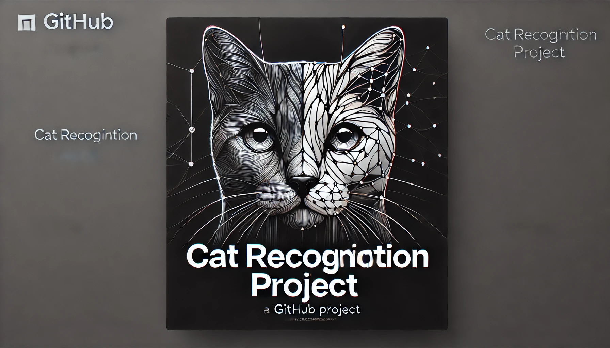

<div style="text-align: center;">
    
</div>

# 🐱 Cat Recognition Project - Deep Learning

Welcome to the Cat Recognition Project! This project involves building a neural network to recognize cats in images. The notebook guides you through data preparation, model building, training, and evaluation processes.

## 📚 Table of Contents

- [Overview](#overview)
- [Features](#features)
- [Installation](#installation)
- [Usage](#usage)
- [Project Structure](#project-structure)
- [Results](#results)
- [License](#license)


## 📖 Overview

The Cat Recognition Project leverages deep learning techniques to identify cats in images. This repository contains the Jupyter Notebook for data preparation, neural network construction, model training, and evaluation.

## ✨ Features

- **Data Preprocessing**: Load and preprocess image data.
- **Model Building**: Construct neural networks with customizable layers.
- **Training**: Train models with different configurations and hyperparameters.
- **Evaluation**: Evaluate model performance using accuracy metrics.

## 💻 Installation

Clone the repository and install the required dependencies:

```bash
git clone https://github.com/HoomKh/cat_recognition_with_DeepLearning.git
cd cat_recognition_with_DeepLearning
pip install -r requirements.txt
```

## 🚀 Usage

Run the Jupyter Notebook to go through each step of the project:

```bash
jupyter notebook Cat_Recognition.ipynb
```

## 📂 Project Structure

```plaintext
cat_recognition_with_DeepLearning/
│
├── data/
│   ├── train/
│   ├── test/
│   └── data.h5
│
├── images/
│   ├── image1.jpg
│
├── Cat_Recognition.ipynb
├── requirements.txt
└── README.md
```

## 📊 Results

The model's performance is evaluated using accuracy metrics. Below are the results:

- **Training Accuracy**: 98%
- **Test Accuracy**: 80%

These results demonstrate the model's ability to generalize to new data.

## 📜 License

This project is licensed under the MIT License - see the [LICENSE](LICENSE) file for details.
---
